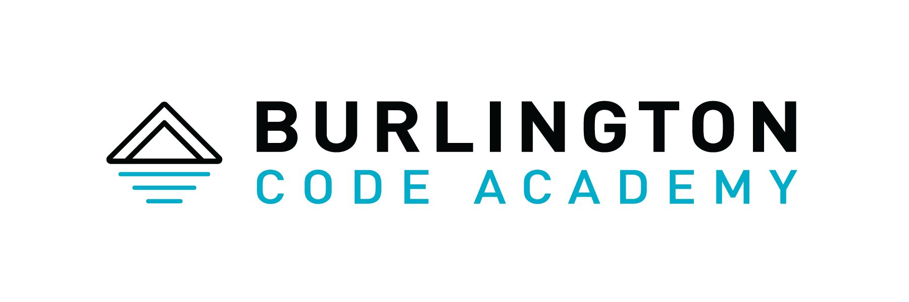

<h2 align="center"><a href="http://bootcamp.burlingtoncodeacademy.com">Source for Burlington Code Academy Curriculum</a></h2>

  
  
  
  
  
  
  
  
  
  
  
  
  

   This work is licensed under a <a rel="license" href="http://creativecommons.org/licenses/by-nc-sa/3.0/">Creative Commons Attribution-NonCommercial-ShareAlike 3.0 Unported License</a>.

## Setup

First, make your own fork, and [install Ruby](http://installfest.railsbridge.org/installfest/) and [git](https://git-scm.com/) on your computer. Then...

1. `git clone XXX` (where XXX is either `https://github.com/burlingtoncodeacademy/codelikethis.git` or your personal github repository URL)
2. `cd codelikethis`
3. `gem install bundler`
4. `bundle install`
5. `rake spec` (to run all tests and verify setup)
6. `rake build` (to compile CSS)
7. `rake run` (or `rerun` to rebuild/restart on file changes)
8. open <http://localhost:9292>

## Usage

SCSS is currently built using Sass. Run this all the time in development, or at least once before deploy after you change anything:

    rake build

|Command|Description|
|---|---|
|`rake spec` | run all tests and verify setup |
|`rake build` | compile CSS |
|`rake run` | run local server on <http://localhost:9292>  |
|`rerun rackup` |run with rebuild/restart on file changes |
|`rerun --pattern '*.scss' --exit -- rake build` | run this in a separate terminal to compile CSS when SCSS changes too |
|`./check-links.sh` | check entire site for broken links |

Note that any of the above may need to be preceded by `bundle exec` e.g. `bundle exec rerun rackup` (whether you need to do this or not depends on gnarly details of your Ruby installation).

## Deploying

Local -> Github -> CircleCI -> Heroku

 * https://dashboard.heroku.com/apps/btvca-curriculum/deploy/github
 * https://circleci.com/gh/BurlingtonCodeAcademy/codelikethis
 * https://github.com/settings/applications
 * https://github.com/BurlingtonCodeAcademy/codelikethis/settings/hooks/90661849
 
## Layout 

|Path|Description|
|---|---|
|`./app.rb` | main app |
|`./config.ru` | app config |
|`lib` | ruby source code |
|`lib/thing.rb::WEIRD_WORDS` | list of oddly-capitalized words (e.g. CSS, JavaScript) |
|`lib/bootcamp.rb` | ruby Site describing the Bootcamp course(s) |
|`lib/bootcamp-schedule.json` | JSON describing the Bootcamp course schedule |
|`spec` | ruby test source code |
|`public` | web-visible files |
|`public/images` | web site images |
|`public/lessons/images` | images used by some lessons |
|`public/lessons/foo/bar.jpg` | an image used by only a single lesson |
|`public/js`     | web site scripts |
|`public/css`    | web site css files -- **do not edit** these directly! |
|`public/scss`    | web site sass source files, compiled into public/css |
|`public/lessons` | course files (markdown and images), organized by track |
|`public/lessons/trackname/` | track files (markdown and images), organized by track |
|`public/lessons/trackname/trackname.rb`  | track description files; names match public/lessons subdirs |
|`public/lessons/trackname/baking.md` | markdown slides for a single lesson named `baking` (served from `/lessons/trackname/bake_cookies` URL path) |
|`public/projects/bake_cookies.md` | markdown slides for a single project named `bake_cookies` (served from `/projects/bake_cookies` URL path) |

## Sites

a Site is

  * a hostname
  * an ordered collection of Tracks
  * a home page
  * a schedule

Currently there are three Sites:

1. The Bootcamp Curriculum <http://bootcamp.burlingtoncodeacademy.com>
1. JavaScript After Hours <http://js-intro.burlingtoncodeacademy.com>
1. JavaScript One Night Introduction <http://taste-of-js.burlingtoncodeacademy.com>

Both sites are served from the same web application instance, running on Heroku (<http://btvca-curriculum.herokuapp.com>). The app looks at `request.host` and serves a different Site to each hostname.

To add a Site, follow the example of [Bootcamp](lib/bootcamp.rb).

To point DNS at a new Site:
1. run `heroku domains:add newsite --app btvca-curriculum`
2. run `heroku domains --app btvca-curriculum` and note the "DNS Target" for your new site
3. in your DNS manager, add a CNAME record pointing the subdomain name (e.g. `newsite`) to the DNS target (e.g. `salty-hyena-j9awwxxx123.herokudns.com`)

(Note that [Heroku SSL ACM](https://devcenter.heroku.com/articles/automated-certificate-management) does not support wildcard domains, so each CNAME
subdomain will need a separate heroku DNS Target.)

To view a Site locally, use a `site` parameter, e.g. <http://localhost:9292/?site=bootcamp>. This parameter *sets a cookie* so future page requests will stay on that site; this is a convenience for localhost development and should not be used in a production environment (and if it is used, it may override the *real* site as specified by the subdomain).

## Adding a Track

1. Decide on its name. Its name is a `camelcase_word` that will automatically turn into titlecase when displayed. (e.g.  `cook_food` => `Cook Food`)
2. create a new subdir inside `public/lessons` (e.g. `public/lessons/cook_food/`)
3. define a `Track` subclass in a new file inside that dir (e.g. `public/lessons/cook_food/cook_food.rb`) and 
4. declare your lessons inside the track file. Look at the existing `.rb` files inside `public/lessons` for examples.
5. for each Lesson, put its slides in a markdown file with its name in the lessons directory (e.g. `public/lessons/cook_food/stirfry.md`)
6. add the Track to your Site by following the example of [Bootcamp](lib/bootcamp.rb)

## Projects

Currently a project consists of a markdown file in the `public/projects/` directory e.g. `public/projects/foo.md`. It is viewable via the path `/projects/foo` (note the lack of file extension).

To declare a project is a bit scattershot. It can be referenced in several places:

1. in the schedule JSON attached to a given week
2. in a Lesson file (not the slides markdown)
3. in a Track file, directly under the Track
4. in a Track file, nested under a Lesson

We should clean this up, so we don't have duplication/omission of e.g. project descriptions depending on where they're defined/referenced.

## URL Rewriting

If you rename a track or lesson, add an entry to `config.ru` so external links to the old name do not become dead links.

`config.ru` also rewrites incoming URLs containing underscores, converting from snake_case to kebab-case for lessons, projects, etc. -- but **NOT** for image files and other media -- and the app can find lesson etc. files in either snake_case or kebab-case format. 

