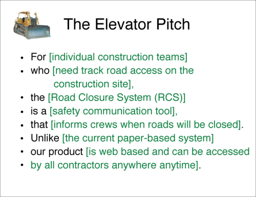

# What is an Inception?

* an exploratory workshop…
* where the whole team…
* defines the goals and themes for a project…
* and produces an initial backlog…
* to kickstart an iterative process

# On Planning

> “Plans are useless, but planning is essential”

.

> “No plan survives contact with the enemy”

# Inception Goals

* define the project’s goals, anti-goals, risks
* write elevator pitch and/or mission statement
* define user Personas, Roles and Activities
* produce an initial story backlog
* produce a rough project timeline
* establish initial recurring schedule for team meetings
* sketch technical architecture (but avoid Big Design Up Front)
* introduce the team to each other

# Optional Inception Goals

* build paper prototype
* write team charter
* determine need for more discovery
* start project glossary (aka *ubiquitous language* or *domain language*)

# Inception Anti-Goals

* working software
* set anything in stone
  * it's an iterative process; everything may change
* set rigid requirements and deadlines
  * we will know more later
* others?

# Inception Schedule

* can be one day, two days, or a full week
* needs a facilitator
* invite as much of the whole team as possible

# Sample Inception Schedule


from [Pivotal Labs](http://cargocollective.com/pivotallabs/No-7-Dev-Inception)

# Project Goals

*  keep all goals SMART (specific, measurable, achievable, relevant & time-bound)

*  business goals
*  product goals
*  engagement goals

# Team goals

* workday experience and pacing
* exploring technology vs. exercising skills
* using new or old processes (e.g. remote pairing)

# Project Non-Goals

* aka "The Not List"
*  things we explicitly do not want to accomplish in the project
*  useful when there’s a priority decision to be made
  *  e.g. if a non-goal is “support mobile” then we can ignore Mobile Safari bugs
* It's also OK to list unknown or unresolved goals

# Project Risks

*	Business risks
  * Does the market want this?  
  * Will an emerging technology disrupt this product? 
  * Can the client support success?
*	Technical risks
  * Are there 3rd party integrations?
  * Are there unknown technologies or libraries to learn?
  * Does the product rely on platforms that are changing, e.g. Android or Apple Watch?
*	Schedule risks
  * Must we satisfy other parties, e.g. developers on another team?  
  * Is there a near term, immovable milestone like a festival launch?
*	Budget risks
  * Will we run out of money before beta? Before launch? Before handoff?

Based off <http://pivotallabs.com/agile-inception_knowing-what-to-build-and-where-to-start/>

# Team Risks

How do we want to work?

* Part-time (vs. dedicated) team?
* Remote (vs. co-located) team?
* Customer unavailable?
* Deployment environment hassles
* Customer :: Project Manager :: Developer :: Designer :: QA Tester :: Support ratios

# Elevator Pitch

*  mad-libs game



(from <https://agilewarrior.wordpress.com/2010/11/06/the-agile-inception-deck/>)

# Mission Statement Game

* everyone writes a mission statement
* highlight important words
* sit on it
* collaborate to write and reach consensus on a final statement
  * hopefully without a lot of “and” clauses

# Personas

*  traditionally: personas map to types of users
*  can also include developers, clients, admins, customer support reps, QA testers, apps, spammers…
*  one persona per card/sheet

# Roles and Activities

*  for each persona, ask what they can do (and can’t)
*  one card for each activity
*  one card for each role
*  diagram relationships among personae and activities and roles

# Advice for Facilitators

  (for Story Mapping but really for any planning or retro game)

*  Stay impartial
*  Assign a Timekeeper and a Scribe (so you can focus on the meeting, not the logistics)
*  Try to ask questions, not make statements
*  After asking a question, count to ten! someone else will fill the silence
*  Ask clarifying questions, even if you know the answer
*  If the conversation veers, steer it back to the original topic (or ask for consensus to change topics)
  * Use a Parking Lot list for items to deal with immediately after the meeting
  * (I prefer the title IOU)
*  If the conversation ebbs, ask if anyone sees a pattern… or has a suggestion… or if it’s time for a break

# Story Mapping

*  very time-consuming
*  take plenty of breaks! facilitator, don’t rush!
*  goal is to get broad and deep, clustering rather than prioritizing
*  looking for themes, not details
*  but still, try to break down stories into smaller stories

> ["The goal isn’t to get all the cards created, but to establish a rhythm of story creation."](http://agilecoffee.com/using-an-inception-to-kick-off-a-project/)

# Story Mapping Example


<http://winnipegagilist.blogspot.com/2012/03/how-to-create-user-story-map.html>

# Stories

* A story:
  * provides business value
  * is discrete
  * is testable
  * is estimatable
  * can be implemented within 1 iteration
* Usually one story per feature, bug, or chore

# Story Body Template

```
AS A ____
I WANT TO ____
SO THAT ___
```

 

# Epics

*  An Epic is a series of Stories
*  For instance the epic “User Accounts” could include “Sign up, Sign in, Change password, Edit profile, Upload avatar”
  *  (not necessarily in that order, of course)
*  Put epics across the top row, stories in columns underneath their epic

# Story Mapping Order

1. Write Story Titles
2. Organize Stories into Epics
3. Prioritize Stories under Epics
4. Write Stories
5. Estimate Stories
6. Prioritize Stories into a Backlog (across Epics)

# Iteration Zero

* sometimes inceptions reveal that a project is not yet ready to build
* the first iteration can be used for continuing the discovery phase of a project
* the team can use the first iteration (sprint) for...
  * building a prototype
  * "spiking" proof of concept on architectural or usability unknowns
  * setting up technical infrastructure (build, deployment, environments)
* these experiments should be bounded and scoped just like "real" features

# Recurring Meetings

Inceptions are a great place to establish the regular rhythm of the project, as punctuated by recurring meetings.

*  Daily Standup
*  Weekly Iteration [Planning](planning) (IPM)
*  [Acceptance](planning) (can be weekly, semi-weekly, ad hoc, or any combination)
*  [Retrospectives](planning) (weekly, bi-weekly, or monthly)
*  Demos (often coincide with Acceptance, but not always)
*  User Testing sessions
* Others?

# Next Steps

* Review Parking Lot / IOUs
* Schedule additional meetings
* Assign someone to capture cards and diagrams into Tracker

# Retrospective & Closing

* Have a brief Retrospective about this inception.
  * What worked?
  * What didn't?
  * Specific feedback for the facilitator?
* Appreciation Circle
* Any last thoughts?

# Party Time!

* We're done!

# References

* http://blog.pivotal.io/pivotal-labs/labs/agile-inception_knowing-what-to-build-and-where-to-start
* http://agilecoffee.com/using-an-inception-to-kick-off-a-project/
* http://cargocollective.com/pivotallabs/No-7-Dev-Inception
* https://agilewarrior.wordpress.com/2010/11/06/the-agile-inception-deck/
