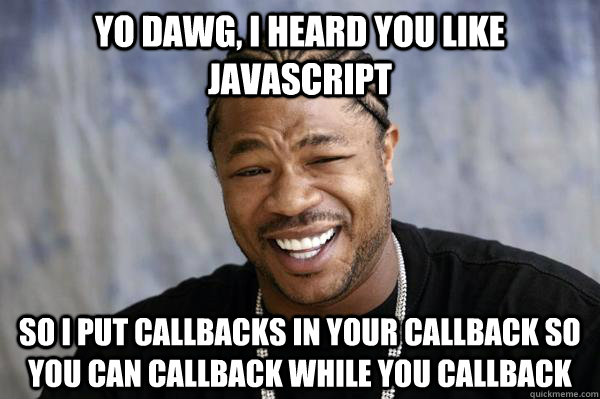

# MongoDB Example

Let's analyze the source code of the TIL app to understand the steps involved in using MongoDB from NodeJS.

Follow along here: <https://github.com/BurlingtonCodeAcademy/til/blob/master/til.js>

# Connect

Connect to MongoDB with a URI:
  
    const url = process.env.MONGODB_URI || 'mongodb://localhost:27017';

> if there's a shell environment variable named MONGODB_URI, use it; otherwise, connect to localhost

# Read the Command Line Parameters

This isn't Mongo-related but it might be confusing.

When the user runs `til` like this:

    til add dogs like to bark
    
then `process.argv` looks like this:

    [ '/usr/local/Cellar/node/10.5.0_1/bin/node',
      '/usr/local/bin/til',
      'add',
      'dogs',
      'like',
      'to',
      'bark' ]     

The first two parameters are not useful to us; the next parameter is the command name; and all the remaining parameters comprise the text of the lesson we want to save.

So after running these commands:

    let params = process.argv.slice(2);
    let command = params.shift();
    let text = params.join(' ').trim();

we have the following values:

|variable|value|
|---|---|
|params| `['dogs', 'like', 'to', 'bark' ]` |
|command| `add`
|text| `'dogs like to bark'

# Callback Hell

Like many NodeJS libraries, `mongodb` relies heavily on *asynchronous events*.

This means that when you call a function, you often need to pass in a *callback function*. This lets your code regain control after the library has finished doing what you asked it to do.

see <http://callbackhell.com/> 

# I Put Callbacks In Your Callback

Additionally, sometimes your callback is passed  *yet another callback function* which you **must** call when your code is finished.  



# `connectAnd`

This function is responsible for 

1. opening a connection to the MongoDB server
2. finding the *collection* of TIL entries
3. passing that collection to a callback
4. closing the connection to the MongoDB server

Step 3 uses a callback function that the caller passes in. This callback accepts 3 parameters:

1. the Mongo `db` object
2. the Mongo `collection` object
3. *another callback* to send control *back* to `connectAnd` to finish up 

```
function connectAnd(callback) {
  MongoClient.connect(url, { useNewUrlParser: true }, function (err, client) {
    assert.equal(null, err);

    const db = client.db(dbName);
    const collection = db.collection('entries');

    callback(db, collection, () => {
      client.close();
    });
  });
}
```

# `saveEntry`

This function 

1. uses `connectAnd` to retrieve the *collection* object
2. inserts an entry into it
3. *calls back* so `connectAnd` can finish up and close the connection

```
function saveEntry(entry) {
  connectAnd((db, collection, finishUp) => {
    collection.insertOne(entry, (err, r) => {
      assert.equal(null, err);
      assert.equal(1, r.insertedCount);
      finishUp();
    });
  });
}
```

# `printEntries`

This function 

1. uses `connectAnd` to retrieve the *collection* object
2. uses `collection.find` to retrieve a *cursor* to walk through all the entries in that collection
3. prints each entry
4. *calls back* so `connectAnd` can finish up and close the connection

```
function printEntries() {
  connectAnd((db, collection, finishUp) => {
    let cursor = collection.find({}).sort([['when', 1]]);
    let currentDay;
    cursor.forEach((entry) => {
      currentDay = printEntry(entry, currentDay);
    }, function (err) {
      assert.equal(null, err);
      finishUp();
    });
  });
}
```
