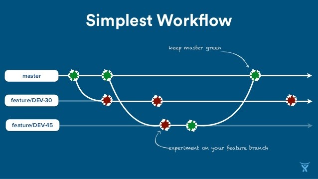

# git vs GitHub
[git](https://git-scm.com/book/) is a *distributed version control tool*

[GitHub dot com](https://github.com/) is a *centralized collaboration website*

# Git Conceptual Model

# Basic Git Commands

|command|description|
|---|---|
|`git clone`|copy a remote repo to your local disk|
|`git add`| stage your local changes|
|`git commit`| save your local changes with comments| 
|`git pull`| sync and merge with the remote repo|
|`git push`| send all your local changes to and merge with the remote repo
|`git checkout -b foo`| create a local branch named "foo"| 
|`git status`| run this all the time!|

# Git Is Weird
* `git checkout .`
    * reverts local file changes
    * but git checkout foo switches to branch foo
* `git add`
    * *stages* your changes locally
    * but `git commit` *saves* your staged changes locally
* `git push origin foo`
    * sends all your commits to a remote branch named `foo`
    * but `git push origin :foo` *deletes* remote branch named `foo`
* `git reset`
    * reverts staged edits, but doesn’t revert file changes
* `git branch`
    * *lists* local branches
    * but `git checkout -b` *creates* a local branch

# Branches

> A branch is a **pointer** to a **commit**

* When you run git commit, the current branch is updated to point to the new commit
* When you run git push, the remote branch is updated to point to the same commit as your local branch
* When you run git pull, the local branch is updated to point to the same commit as the remote branch

# Named Branches

* When you start work on a story, create a named branch for it

        git checkout -b search-by-username

* While working on it, continuously merge or rebase from master
* When ready for feedback, create a Pull Request based on the branch
* When complete (or earlier if possible), merge to master

# Simple Git Workflow

http://www.slideshare.net/GoAtlassian/superpowered-ci-with-git-sarah-goffdupont

# Pull Request

* Also known as "PR"
* A *GitHub* (**not** git!) feature to share your work before merging to master
* For feedback, code review, and to keep master consistent and correct ("green")

> If you always use pull requests, then code on `master` is **guaranteed** to have been reviewed.

[TODO: screenshots?]

# Feature Branch Details

* aka Story Branch or Topic Branch
* embodies a coherent *set of changes* for a *feature* 
  * or some other *coherent improvement* to the code
* one branch can have several commits
* includes code, documentation, tests, and other changes for *that feature*
  * all changes hang together 
  * discuss and review on GitHub
  
# Feature Branch Rules

* always work in a (local) branch
* name your branch after the feature you're working on
* base your local branch from `master`, not from your own work-in-progress branch
* base your pull request from the feature branch, not from (your own) master branch
* merge / rebase / squash according to your team's preferences

# Code Review Rules

* be nice, be respectful, be clear
  * BAD: "bogus regex"
  * GOOD: "This regex incorrectly matches foo@bar@baz.com."
  * BETTER: "This regex will match some invalid email addresses (e.g. ` foo@bar@baz.com`); is that intentional?"
* phrase criticism as personal feelings and/or questions
  * BAD: "Extract this into a function."
  * GOOD: "IMHO this should be its own function."
  * BETTER: "It seems to me this would be clearer as a named function; what do you think?"
* be clear about the severity of your suggestions
  * BAD: "Rename this variable."
  * GOOD: "Nitpick time: this variable name is unclear to me; how do you feel about naming it 'numberOfCows' instead of 'cowNum'?"
 

# Apache Voting

An old open source trick to reach consensus in an online discussion: use the +1/+0/-0/-1 scale.

**+1** : "I’m willing to try and convince you we should do this."

**+0** : "I don't feel strongly about it, but I'm okay with this."

**-0** : "I'd rather we didn't do this, but if others want it, I won't object."

**-1** : "I strongly disagree and am willing to argue my case."

https://www.apache.org/foundation/voting.html#expressing-votes-1-0-1-and-fractions

# GitHub Review

* relatively new feature
* many teams don't use it (yet)
