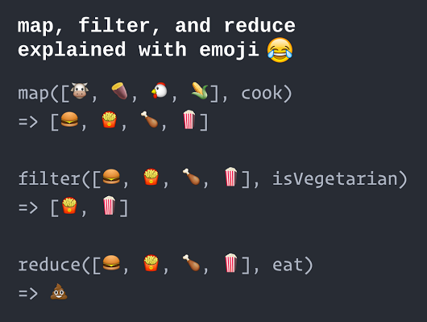

    topic name: "each"
    topic name: "map"
    topic name: "filter"
    topic name: "reduce"
    topic name: "callbacks"
    link name: "Higher-order Functions",
         href: "http://eloquentjavascript.net/05_higher_order.html",
         from: "EloquentJavaScript"
    link name: "Array Iteration Methods",
         href: "https://developer.mozilla.org/en-US/docs/Web/JavaScript/Reference/Global_Objects/Array#Iteration_methods",
         from: "Mozilla Developer Network"

# Arrays are Objects

Surprise! 

Every JavaScript *array* is also a JavaScript *object*

That means that arrays have *properties* and *methods* like any other object.

Examples:

  * `array.length` is a *read-only property* that always contains the number of elements in the array
  * `array.reverse()` is a *method* that reverses the ordering of all elements in the array 

See [MDN: Array](https://developer.mozilla.org/en-US/docs/Web/JavaScript/Reference/Global_Objects/Array#Methods_2) to see a lot more array methods

# Iteration Methods

Every JavaScript array has a few [very handy methods](https://developer.mozilla.org/en-US/docs/Web/JavaScript/Reference/Global_Objects/Array#Iteration_methods)
that let you *apply a function* to its contents.

| method | description | returns |
|---|---|---|
| [`forEach`](https://developer.mozilla.org/en-US/docs/Web/JavaScript/Reference/Global_Objects/Array/forEach)  | do something to each item | `undefined`|
| [`find`](https://developer.mozilla.org/en-US/docs/Web/JavaScript/Reference/Global_Objects/Array/find)  | find the first item that matches | one matching item (or `undefined` if no match) |
| [`filter`](https://developer.mozilla.org/en-US/docs/Web/JavaScript/Reference/Global_Objects/Array/filter) | accept or reject each item | a new collection, possibly smaller |
| [`map`](https://developer.mozilla.org/en-US/docs/Web/JavaScript/Reference/Global_Objects/Array/map)  | change each item into a new item | a new collection of the same size |
| [`reduce`](https://developer.mozilla.org/en-US/docs/Web/JavaScript/Reference/Global_Objects/Array/reduce)  | scan the entire collection and "reduce" it to... | ...a single result, e.g. a total |

* We call this group of methods "[iteration methods](https://developer.mozilla.org/en-US/docs/Web/JavaScript/Reference/Global_Objects/Array#Iteration_methods)"
* There are about a dozen built-in iteration methods, plus lots more added by libraries like [lodash](https://lodash.com/). 

# forEach

`forEach` works a lot like `for..of`, but using a callback function

Given this array of names...

```javascript
let names = ['Alice', 'Bob', 'Carol', 'Charlie', 'David']
```

|this code... | and this code... |
|---|---|
|<pre><code class="javascript">for (let name of names) {<br>&nbsp;&nbsp;console.log(name.toUpperCase())<br>}<br></code></pre>|<pre><code class="javascript">let printUpper = function(name) { <br>&nbsp;&nbsp;console.log(name.toUpperCase())<br>}<br>names.forEach(printUpper)</code></pre>|

both print the same thing:

```text
ALICE
BOB
CAROL
CHARLIE
DAVID
```

# Find

to find the first item that matches the condition...

```javascript
let names = ['Alice', 'Bob', 'Carol', 'Charlie', 'David'];
let beginsWithC = function(word) {
    return word.charAt(0).toUpperCase() === 'C';
};
let cName = names.find(beginsWithC) //=> 'Carol'
```

Note that:

* the `beginsWithC` function returns `true` or `false`
* the `find` method returns an item (from the array)

# Find Inline

For conciseness, people often define the filter function *inline*, like this:

```javascript
names.find((word) => word.charAt(0).toUpperCase() === 'C')
```

Q: Is this more or less clear than the previous slide?

# Lab: Find a Berry

Given the following array:

```javascript
let fruits = ['Apple', 'Blueberry', 'Cherry', 'Date', 'Elderberry']
```

write some code that uses `find` to return the first item that ends with the string `'berry'`

(in this case, `'Blueberry'`)

# Filter

the `filter` iteration method returns *all* matching values, in a *new array*

```javascript
let names = ['Alice', 'Bob', 'Charlie', 'Carol', 'David'];
let beginsWithC = function(word) {
    return word.charAt(0).toUpperCase() === 'C';
}
let cNames = names.filter(beginsWithC) //=> [ 'Charlie', 'Carol' ]
```

# Lab: Find all Berries

Given the following array:

```javascript
let fruits = ['Apple', 'Blueberry', 'Cherry', 'Date', 'Elderberry']
```

Now go find your code from the previous lab ("Find a Berry")
and change it to use `filter` to return a new array 
containing **all** the fruits that end with the string `'berry'`

> Hint: all you need to do is change `find` to `filter` -- the matching function itself is the same. 

# Map

The `map` iteration method returns a *new array* whose elements correspond to the elements of the original array.

```javascript
let names = ['Alice', 'Bob', 'Charlie', 'Carol', 'David'];
let upper = function(word) {
    return word.toUpperCase();
}
let bigNames = names.map(upper) //=> [ 'ALICE', 'BOB', 'CHARLIE', 'CAROL', 'DAVID' ]
```

It's called "map" because in a mathematical sense, it defines a *mapping* from one collection to another.

| from | to |
|---|---|
| 'Alice'| 'ALICE' | 
| 'Bob'| 'BOB' |
| 'Charlie' | 'CHARLIE' |
| 'Carol' | 'CAROL' |
| 'David' | 'DAVID' |

# Lab: Titleize with Map

Remember the [capitalize function](./functions#anchor/capitalize)? It capitalizes the first letter of a string and makes the whole rest of the string lowercase.

```javascript
function capitalize(word) {
  let firstLetter = word[0];
  let restOfWord = word.slice(1);
  return firstLetter.toUpperCase() + restOfWord.toLowerCase();
}
```

Now please try to write a function that capitalizes *each word* in a string.

```javascript
titleize("the rain in spain falls MAINLY on the PLAIN")
  //=> 'The Rain In Spain Falls Mainly On The Plain'
```

There is a solution on the next slide, but please try on your own first.

> Hint: Inside your titleize function, you could call the existing capitalize function. Or you could "inline" the capitalization code. Or you could do something else! 

# Solution: Titleize

Here's one way to do it:

```javascript
function titleize(phrase) {
  return phrase.split(' ').map((word) => capitalize(word)).join(' ');
}
```

Here's another, where the existing `capitalize` method is used *as is* as a mapping function:

```javascript
function titleize(phrase) {
  return phrase.split(' ').map(capitalize).join(' ');
}
```

And another:

```javascript
function titleize(phrase) {
    let words = [];
    let originalWords = phrase.split(' ');
    originalWords.forEach((word) => {
        words.push(capitalize(word))
    });
    return words.join(' ');
}
```

* The first two solutions use **method chaining** -- taking the **result** of one method, and immediately calling a method on that result **without assigning it to a variable**, again and again until you get a final result.
* Method chaining can be very elegant, but it can also be very dense, making the code harder to understand, test, and debug.
* "Unspooling" a method chain into intermediate variables (like example 3) can make the code easier to follow, but it can also make it cluttered and obscure the algorithm.

> Whether to use method chaining is a very subjective aesthetic judgement. YMMV!


# Reduce

The `reduce` method keeps track of a *running total* (aka *accumulator* or *memo*); whatever value the function returns is used as the accumulator for the next pass.

Here's some code that counts the total number of letters across all words in an array:

```javascript
let names = ['Alice', 'Bob', 'Charlie', 'Carol', 'David'];
const reducer = function(accumulator, word) {
    return accumulator + word.length;
};
let totalCount = names.reduce(reducer, 0); //=> 25
```

The `reduce` algorithm can be difficult to follow at first; here's a walkthrough:

| Iteration | Accumulator In | Word | Length | Accumulator Out |
|---|---|---|---|---|
| 1 |  0 | 'Alice'   | 5 | 0 + 5 = 5 |
| 2 |  5 | 'Bob'     | 3 | 5 + 3 = 8 |
| 3 |  8 | 'Charlie' | 7 | 8 + 7 = 15 |
| 4 | 15 | 'Carol'   | 5 | 15 + 5 = 20 |
| 5 | 20 | 'David'   | 5 | 20 + 5 = 25 |

See how the accumulator is used to pass information from one iteration to the next?

# Iteration Methods in Emoji



<small>(image used with [permission](https://twitter.com/AccordionGuy/status/1098031540725051399) by [@AccordionGuy](https://twitter.com/AccordionGuy) based on [a tweet by @steveluscher](https://twitter.com/steveluscher/status/741089564329054208) -- with a [working implementation](http://www.globalnerdy.com/2016/06/26/demonstrating-map-filter-and-reduce-in-swift-using-food-emoji/) 😲 in Swift)
</small>
