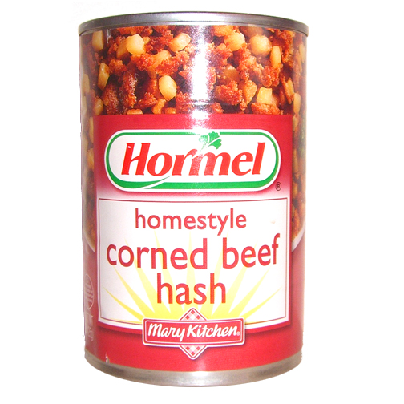

    topic name: "hashes"
    topic name: "objects"
    topic name: "key-value-pairs"
    topic name: "setting-getting"
    topic name: "strings"
    topic name: "values"
    topic name: "methods"
    topic name: "functions"
    topic name: "data-structures"
    link from: "EloquentJavaScript",
         href: "http://eloquentjavascript.net/04_data.html",
         name: "Eloquent JavaScript Chapter 4: Data Structures: Objects and Arrays"
    project name: "zorkington"

# Software Models the World

* Data Structures allow for programmers to make models of the world in code.
* People naturally think of the world as made up of things.
* Programming languages have ways to represent things.
* JavaScript's primary way of representing a thing is an "Object".
* JavaScript objects let you describe things in any way you can imagine.
  * As long as your description is valid JavaScript :)

> All models are wrong, but some are useful. -- [George Box](https://en.wikipedia.org/wiki/All_models_are_wrong)

# An Object Contains Properties

```javascript
let abby = {
  'species': 'dog',
  'color': 'brown',
  spayed: true,
  breed: 'mutt',
  weight: 40,
  'favorite activity': 'chasing squirrels'
}
```

* This is called **object literal** syntax since it defines the object exactly as it's **written**.
* The string on the left is called the *key*; the string on the right is called a *value*; the two together are called an *entry* or a *property*.
* JavaScript object keys are always strings, but if the key has no spaces in it, you can omit the quotations
* `let abby = {...}` is an assignment, setting the variable `abby` to point to the object we just defined

# An Object is a Lookup Table

An object is useful for putting many similar things together.

Let's make an object that maps a state's *abbreviation* to its *full name*

*Type this in a NodeJS console*:

```javascript
let states = {
  'VT': 'Vermont',
  'CA': 'California',
  'MA': 'Massachusetts',
  'NY': 'New York'
}
```

# Getting Object Properties

You can get the properties of an object with either *dots* or *brackets*:

| With Dots   | With Brackets  | The Value         |
|-------------|----------------|-------------------|
| `states.VT` | `states['VT']` | `'Vermont'`       |
| `states.CA` | `states['CA']` | `'California'`    |
| `states.MA` | `states['MA']` | `'Massachusetts'` |
| `states.NY` | `states['NY']` | `'New York'`      |

Both syntaxes are useful in different situations.

```javascript
states['VT']  // 'Vermont'
states.VT     // also 'Vermont'
```

# Setting Object Properties

* You can set the properties of an object with either *dots* or *brackets* followed by a `=` (single equal sign)
* Adding properties works even after the object has been created.

```javascript
states.WY = 'Wyoming'

states['FL'] = 'Florida'
```

* Setting a property with a key that already exists *removes* the original value first
```javascript
states.VT = 'The Green Mountain State'
```

# Dots vs. Brackets

Dots are prettier than square brackets, but less versatile, since some keys simply cannot be represented using dot notation, and trying to use them causes syntax errors.

The bracket `[]` syntax is less common but covers more uses (e.g., if the key contains spaces, or is inside a variable).

```javascript
> let capitals = {}
{}

> capitals.New York = 'Albany'
capitals.New York = 'Albany'
             ^^^^
SyntaxError: Unexpected identifier

> capitals.'New York' = 'Albany'
capitals.'New York' = 'Albany'
         ^^^^^^^^^^
SyntaxError: Unexpected string
```

If you get those errors, revert to brackets, which is more reliable:

```javascript
> capitals['New York'] = 'Albany'
'Albany'
> capitals
{ 'New York': 'Albany' }
```

# Dots vs. Brackets vs. Variables

You can use variables instead of literals to get and set properties.

Given this code ...

```js
let items = {
    brick: 'red'
}
let item = 'brick'
```

... two of the following expressions look for *a key named `item`*, but only one looks for a key named *the value of the variable named item*:

| code            | value       | explanation                         |
|-----------------|-------------|-------------------------------------|
| `items.item   ` | `undefined` | "get me the property named 'item'"  |
| `items['item']` | `undefined` | "get me the property named 'item'"  |
| `items[item]  ` | `'red'`     | "get me the property named 'brick'" |

> This can be confusing!

# An Object is a Data Structure

Objects are good for a lot more than mere one-to-one maps. They allow you to design *data structures* that are as complicated and as deeply nested as you can imagine...

```javascript
let alice = {
  name: 'Alice Abrams',
  age: 36,
  married: false,
  homeAddress: {
    street: '12 Maple St.',
    city: 'Burlington',
    state: 'VT',
    zipCode: '05401',
    location: {
      latitude: 44.4759,
      longitude: -73.2121
    }
  },
  pets: ['Mittens', 'Fido']
}
```

Given the above, the value of `alice.homeAddress.zipCode` is `'05401'`

> Note: The above shows the essence of [JSON](../javascript/json):
> a syntax for representing data structures containing primitive values,
> including nested objects and arrays.

# Looping through an object with for...in

Here's a way to loop through every property in an object.

This `for..in` loop grabs every property in the `states` object, 
one at a time,
and inside the loop,
sets the `state` value to that property's *key*

```js
for (let state in states) {
    
}
```

In your NodeJS console, try to write code that outputs:

```
CA is short for California
MA is short for Massachusetts
NY is short for New York
```

<details>
<summary>Solution:</summary>
<pre>
for (let state in states) {
    console.log(state + ' is short for ' + states[state]);
}
</pre>
</details>

**Note:** use "`for...of`" for arrays, use "`for...in`" for objects -- see [this article](https://bitsofco.de/for-in-vs-for-of/) for more detail about **of** vs. **in**.

**WARNING:** remember the `let` or you will be defining a *global variable* named `state`

# LAB: Class GPA

* Given the following `grades` object.
* All grades carry equal weight toward the GPA.
* Write a function that calculates the GPA for the student.

```javascript
let grades = {
  'midterm': 3.3,
  'project': 4.0,
  'final': 3.2
}
```

> The answer is 3.5 ... but show your work.

# All keys are strings

* In a JavaScript object, keys must be strings

* **Beware** of using these as keys, since they get converted to strings in unexpected ways:

    * `null`
    * `undefined`
    * `''` (empty string)
    * `false` or `true`
    * `0` (or any number)

# `delete`

To remove a key-value pair from an object, use the keyword `delete`:

```js
states = {
  CA: 'California',
  MA: 'Massachusetts',
  NY: 'New York'
}

{ CA: 'California', MA: 'Massachusetts', NY: 'New York' }

> delete states.MA

true

> states

{ CA: 'California', NY: 'New York' }
```

> note that `delete` is **not** a method; it's a standalone keyword, like a global function

# fake delete

You can get a similar effect by setting the value to `null` or `undefined`, but beware: the key remains!

```js
> states.CA = null
null
> states.NY = undefined
undefined
> states
{ CA: null, NY: undefined }
> for (let state of states) { console.log(state) }
```

> You probably shouldn't do this, since it only removes the *value*, but not the *key*, from the property list.

# LAB: A Menu Order

* Write a program that accepts a food order based on a menu.
  * Name your program `order.js`.
  * Create an object to store all the item names and their prices.
  * Accept an order on the command line and calculate the total for all items.
  * Print the total order price and exit.

| Item   | Price |
|--------|-------|
| Burger | $5.00 |
| Fries  | $3.50 |
| Shake  | $1.11 |
| Salad  | $4.25 |

## Example Program Usage

```
$ node order burger fries

Your order total is $8.50

$ node order burger burger shake fries burger

Your order total is $19.61
```

# Object Instance Methods

Here's a taste of [object instance methods](./methods).

A method is a *function* attached to an *object* as a *property*.

```js
let stringUtils = {
  capitalize: function(word) {
    return word.charAt(0).toUpperCase() +
      word.slice(1).toLowerCase();
  },
  rant: function(opinion) {
    return option.toUpperCase() + '!!!';
  }
}

stringUtils.rant('i love pizza') //=> 'I LOVE PIZZA!!!'
```

# Hash



* during breakfast, *hash* is a *delicious processed meat product*
* during coding, a *hash* is an *abstract data type*

<small>(image credit: [Jeffrey W](https://www.flickr.com/photos/jeffreyww/26139552220), [CC-BY](https://creativecommons.org/licenses/by/2.0/) )</small>

# What makes a hash a hash?

a hash is an

* unordered
* indexed (by strings, not numbers)
* collection
* of key/value pairs

In other words, a hash defines a *mapping* from one group of things to another, like a phone book or a dictionary.

## a hash is also known as a...

  * map or mapping
  * dictionary
  * associative array
  * lookup table
  * key/value store

# hash or object?

In JavaScript, a **hash** is officially called an **object**.

> This is confusing since in every other computer language, "hash" and "object" are quite different things.

## Object != Object-Oriented

* Just using an object as a key-value store does not make your code *object-oriented*.
    * For OOP you need a few extra features, especially the keywords `new` and `this` and `class`
    * We discuss OOP in a separate [OO_JS](../javascript/oo_js) lesson
* In the rest of this lesson we use "object", but elsewhere, you may see "hash" and "object" used interchangeably

# Sidebar: Why is it called a hash?

The most common and useful implementation of this data structure uses something called a *hashing function* to make the lookup efficient. A hashing function allows you to have **huge** amounts of data and still access a single item very quickly.

Think of the Dewey Decimal System: when you look up a book in the card index, it tells you what aisle and shelf to visit to find that book. You don't need to search through the entire library; you just need to search a single shelf.

Because programmers are humans, and humans can be very literal-minded, people named it based on *how* it works, rather than *what* it does or *why* it does it.

*Map* and *Dictionary* are much better metaphors (and in fact there is a recently-introduced JavaScript type called [Map](https://developer.mozilla.org/en-US/docs/Web/JavaScript/Reference/Global_Objects/Map) which behaves better than the built-in "object" hash; for instance, its keys are not limited to being strings).

Also, *hash* is a funny word, and programmers love jokes.

# LAB: more about JS Objects

* FreeCodeCamp:
  * From [Build JavaScript Objects](https://learn.freecodecamp.org/javascript-algorithms-and-data-structures/basic-javascript/build-javascript-objects)
  * to [Accessing Nested Objects](https://learn.freecodecamp.org/javascript-algorithms-and-data-structures/basic-javascript/accessing-nested-objects)
