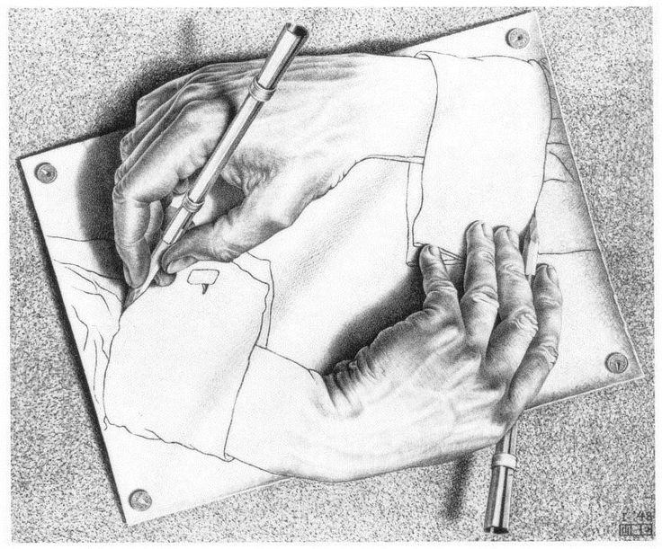

# Recursion

*recursion* is when a function *calls itself*



(like this pair of hands drawing themselves)

# Infinite Recursion

Here's a not very useful recursive function:

    @@@ js
    function go() {
      console.log("Go!");
      go();                // do it all again
    }

To stop this function, press CTRL-C.

# Recursion Requires Termination

For recursion to be useful, it needs to (eventually) stop.


The standard way to stop is called a *guard clause*.

Also called a *base case* or a *terminator*.

    @@@ js
    function countdown(seconds) {
      if (seconds === 0) {
        console.log("Blastoff!");
      }
    }


# Recursion is Reduction

In addition to the base case, a recursive function needs to define at least one other case; this case *wraps around* the base case like a Russian doll.


You can think of a recursive function as starting with a large problem, and gradually reducing the problem until it reaches the base case.

Since the base case has a known solution, every other step can then be built back up on top of it -- which is why it's called the *base*.

In this way, recursion is an example of the *divide and conquer* approach to problem-solving.

# Countdown

The simplest form of recursion uses a counter; in this example we are counting down the seconds until a rocket launches.

    @@@ js
    function countdown(seconds) {
      if (seconds == 0) {
        console.log("Blastoff!");
      } else {
        console.log("" + seconds + "...");
        countdown(seconds - 1);
      }
    }

    countdown(10);

Put the above in a source file called `countdown.js` and try it now. 

Note that when recursing, you *must change* the value of the counter, else recurse forever.

# Challenge: Recursive Factorial

To find the *factorial* of a number N, you take all the counting numbers between 1 and N and multiply them together. 

Write a function called `factorial` that takes a number and returns its factorial.

Remember to start with the base case!

    @@@ js
    factorial(1)    // 1
    factorial(2)    // 2
    factorial(3)    // 6
    factorial(10)   // 3628800
   
   
# Solution: Factorial

    @@@ js
    function factorial(n) {
        if (n == 1) {
            return 1;
        } else {
            return n * factorial(n - 1);
        }
    }

# Recursion vs Loops

Recursion can be seen as another kind of [loop](loops), like `for` or `while` or `reduce`.

In fact, every recursive function can be "unrolled" and rewritten using a loop and (usually) a [stack](stacks).

For example, here is `factorial` using a stack instead of recursion:

    @@@ js
    function factorial(n) {
        let stack = [];
        while (n >= 1) {
            stack.push(n);
            n = n - 1;
        }
        let f = 1;
        while (stack.length > 0) {
            f = f * stack.pop();
        }
        return f;
    } 

What do you think about this implementation compared to the previous one? What are the advantages and disadvantages of recursion vs. loops?

# Challenge: Recursive Fibonacci

Using recursion, write a program called `fib.js` so that running `node fib.js 10` prints

```js
@@@ js
[ 0, 1, 1, 2, 3, 5, 8, 13, 21, 34 ]
```

which are the first 10 elements of the [Fibonacci sequence](https://en.wikipedia.org/wiki/Fibonacci_number).


