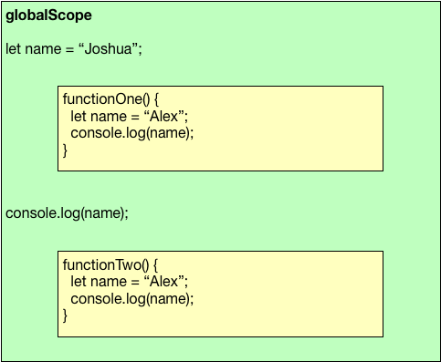

# Scope


*scope* = all the variables that are *visible* from a given location in your code

including:

  * local variables (`let` and `var`)
  * function parameters
  * global variables
  * top-level functions

> scope is a one-way mirror -- inner scopes can see out, but outer scopes cannot see in

# Functions Are One Way Mirrors


# Variable Scope



# Scope Example

```javascript
@@@javascript
function exampleFunction() {
    var x = "declared inside function";  // x can only be used in exampleFunction
    console.log("Inside function");
    console.log(x);
}

console.log(x);  // Causes error
```

# Closure Scope

JavaScript also supports *lexical scope* which means that variables defined *above* the current function may also be visible...

```
function sing() {
  let numberOfBottles = 99;
  function bottlesOfBeer() {
    return "" + numberOfBottles + ' bottles of beer on the wall';
  }
  ...

```

# Lexical Scope

Closures *add a layer* between global and local:

  * local variables and parameters of *nesting closures* of the current function

This is called "lexical scope" because a line of code can "see" all variables that are declared (= written = lexical) in the same code block, even if that code block is inside a different (nesting) function.

# Closure Example

```js
@@@js
let x = 10;
function f(y) {
    return x + y;
}
console.log(f(5));  // 15
```

# Nested Scopes

Every time you invoke a function, JS creates a new *scope* for that function

that points to the *current* scope

and so on recursively

[todo: nested scope diagram]

# Why? 1

* so callbacks can access local variables just like their neighboring code can

# Why? 2

* nested functions, e.g.

        @@@js
        function printGrid(grid) {
            function printRow(rowNum) {
                console.log(grid[rowNum].join(","));
            }
            let i = 0;
            while (i<grid.length) {
                printRow(i);
                i = i + 1;
            }
        }

# Why? 3

* higher-order functions (functions that use other functions, like `map` or `forEach`)

# Why? 4

* encapsulation (this is tricky; for more detail, see the [encapsulation](/javascript/encapsulation) lesson)

        @@@js
        let count = (function() {
            let value = 0;  // private variable
            let increment = function() {
                value = value + 1;
                console.log(value);
                return value;
            };
            return increment;
        })();

        count() // prints and returns 1
        count() // prints and returns 2
