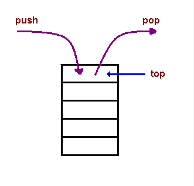

# Stack

* a *stack* is a *metaphor* for a physical stack


[photo by Michael Stern](https://www.flickr.com/photos/68711844@N07/15638298618)
[CC-BY-SA](https://creativecommons.org/licenses/by-sa/2.0/)

# What makes a stack a stack

* a *stack* is an *abstract data type* with only two operators
    * **push** adds an item to the top
    * **pop** removes an item from the top
* a stack is a LIFO (last in, first out) structure

# Pushing and Popping

 

<https://en.wikipedia.org/wiki/Stack_(abstract_data_type)>

# The Freedom of Constraints

Why only two operators?

* it is powerful because of its limitations
    * easier to optimize 
    * easier to debug
    * easier to understand code that uses it

The theme of "Freedom of Constraints" is important in software design. 

(Also in any design or engineering context. And anything creative or artistic.)

# Arrays vs. Stacks

In JavaScript, the easiest way to *implement* a stack is by using an *array*.

In fact, every array *already knows* how to `push` and `pop`.

Try this in node:

    @@@ js
    let fruitStack = []
    fruitStack.push("apple")
    fruitStack.push("banana")
    fruitStack                    // [ 'apple', 'banana' ]
    fruitStack.push("cherry")
    fruitStack                    // [ 'apple', 'banana', 'cherry' ]
    let fruit = fruitStack.pop()
    fruit                         // 'cherry'
    fruitStack                    // [ 'apple', 'banana' ]
    
Note that after a `pop`, the stack's contents are *changed*. Pop *removes and returns* the final value from the array.

# Stack Trace

You may have heard the term "stack trace". A stack trace is part of most error messages, e.g.:

```
ReferenceError: fizz is not defined
    at ReadStream.process.stdin.once (C:\Users\alex\code\hello.js:32:5)
    at Object.onceWrapper (events.js:254:19)
    at ReadStream.emit (events.js:159:13)
    at addChunk (_stream_readable.js:265:12)
    at readableAddChunk (_stream_readable.js:252:11)
    at ReadStream.Readable.push (_stream_readable.js:209:10)
    at TTY.onread (net.js:598:20)
```

In this context the term "stack" refers to the *call stack*.

The JavaScript interpreter is a program, and that program uses a stack internally to keep track of the list of functions that call functions that call functions that call...

For instance, in the above stack trace, you can see that the function `TTY.onread` called the function `ReadStream.Readable.push`, which called the function `readableAddChunk`, and so on.

Now you know why a stack trace is upside down! It's because a stack is LIFO.

See [Understanding the JavaScript Call Stack](https://medium.freecodecamp.org/understanding-the-javascript-call-stack-861e41ae61d4)

# Lab: Fibonacci Stack

Using a stack, put the following program into a file called `fib.js`...

```js
@@@ js
let series = [0, 1];
while (series.length < 10) {


}
console.log(series);
```

...and complete it so that running `node fib.js` prints 

```js
@@@ js
[ 0, 1, 1, 2, 3, 5, 8, 13, 21, 34 ]
```

which are the first 10 elements of the [Fibonacci sequence](https://en.wikipedia.org/wiki/Fibonacci_number).

Although `series` is an array, please treat it like a stack -- that is, you can **only** use `series.push()` and `series.pop()`, not any other array operations.

Please split into pairs and do this right now. A solution is on the next slide.

# Solution: Fibonacci Stack

```js
@@@ js
let series = [0, 1];
while (series.length < 10) {
    let b = series.pop();
    let a = series.pop();
    let c = a + b;
    series.push(a);
    series.push(b);
    series.push(c);
}
console.log(series);
```

Note that we had to pop `a` and `b` in *reverse* order because it's a stack.

Note also that we had to push `a` and `b` back on to the stack after adding them to get `c`.

# Uses for stacks

Stacks are useful in many scenarios

* function call stack
* reverse-polish calculator
* backtracking, e.g. chess AI
* recursion
    
# Project: reverse-polish calculator

<a href='/projects/rpn_calculator'>RPN Calculator</a>


