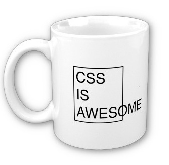

# CSS Layout



<small>([CSS is Awesome mug](https://www.zazzle.com/css_is_awesome_mug-168113658720373401) created by Steven Frank, still available for purchase on Zazzle)</small>

# Inline vs. Block Level Elements

This is where things start to get a little bit tricky - positioning HTML elements using CSS.

There are two main display rules (or "levels") for HTML elements.

1. Block level
  - New line, full width
2. Inline level
  - Same line, width of content

# Inline vs. Block: More Info

Inline elements should only contain data, or other inline elements.

Block level elements can contain both block and inline elements.


# CSS Display Property

Elements are given a default **display** value based on their type - this is a CSS property that determines an element's layout, and how it interacts with other elements.

* `display: block;`
  - The element will take up the full width of the page
* `display: inline;`
  - The element will only take up the width of the content within the element.
* `display: inline-block`
  - Acts as an inline element, but can be given a specific width and height.
* `display: none;`
  - The element will disappear, as will all its children, and its neighbors will be rendered as if it was never there.

See <https://developer.mozilla.org/en-US/docs/Web/CSS/display> for many more `display` values.

# Example of Block vs. Inline Elements

Inherent display properties of commonly-used HTML elements.

| Block Level Elements |
|----------------------|
| div                  |
| p                    |
| table                |
| form                 |
| ul, ol               |
| nav                  |

| Inline Elements |
|-----------------|
| span            |
| a               |
| i, em           |
| b, strong       |
| img             |
| button          |

# Positioning

There are 4 commonly-used position properties in CSS. These further help to position elements on a page. They also help to further confuse you as a developer.

1. **Relative** - Elements are relative to the flow of the HTML document.
  - Elements moved around with the properties top, left, right, bottom. `top:20px;` will move a relatively positioned element 20 pixels from its natural postioning.
2. **Absolute** - This is positioned relative to its parent or ancestor (closest ancestor that is relatively positioned).
  - Any element that is positioned absolutely, will be placed (using the top/left/right/bottom CSS properties) specifically within the parent, irrespective of other sibling elements.

## mnemonic: positions are opposite of their common meaning

 * "position: relative" means "my children are positioned relative to me"
 * "position: absolute" means "I am positioned relative to my parent"

# Positioning (cont.)

* 3. **Fixed** - Position an element is relation to its viewport (browser window).
* 4. **Static**- Same as relative, but cannot be moved with top/left/right/bottom. It is relative to the flow of the HTML document.

`position: fixed` example: 

# Wrapper DIVs

In order to make content layout work in CSS, you often need to introduce *wrapper divs*.

For example, if you have an image with its own caption, and you want them to appear *together* and also have the caption positioned *relative to the image*, you might need to change this:

* [cow html](./cow-raw.html) - raw

```html

<p class='caption'>This is a cow.</p>
```

Into this:

* [cow html](./cow.html) - styled

```html
<div class='image-wrapper'>
  
  <p class='caption'>This is a cow.</p>
</div>

<style>
  .image-wrapper {
    position: relative;
  }
  .image-wrapper .caption {
    position: absolute;
    bottom: 0;
    margin: auto;
  }
</style>
```

<https://www.flickr.com/photos/scott-teresi/7391832092>

# Floats (Intro)

* Floats, to say the least, are weird and can be frustrating.
* It used to be that floats were the only way to achieve specific layouts using CSS, especially:
  * stacking left-to-right or right-to-left
  * forcing an element to be as wide as its contents, not as wide as its parent

# Floating Cow

```html
<style>
  .image-wrapper {
    position: relative;
    float: left;
  }
</style>
```
* [cow float html](./cow-float.html) - styled

Now the caption can be as wide as its parent (the wrapper), since its parent is only as wide as its content (the image).

# Float

| Float Properties |
|------------------|
| left             |
| right            |

* Applying the style `float:left;` to an element will force that element to the left side of the container, and all other elements will 'wrap' around it.


> TIP: applying `clear: both` to an element will make it skip down the page past *all* floats, left and right. This is usually done to a `<br>`

# Float Explanation Video

<iframe width="560" height="315" src="https://www.youtube.com/embed/xara4Z1b18I" frameborder="0" allow="autoplay; encrypted-media" allowfullscreen></iframe>
> YouTube user: tobyonline; Published on Dec 19, 2013; https://youtu.be/xara4Z1b18I

# Floats (Advice)

* For a long time, floats were the backbone of page layout using CSS.
* However, recent developments have allowed developers to use new CSS properties to achieve the same result, and much more.
* Because of this, the `float` property should only be used for wrapping text around images, which was its original purpose - gone are the days of CSS layout using floats.

# LAB: Learn CSS Layout

Do these tutorials:

https://learn.shayhowe.com/html-css/

[Learn CSS Layout](http://learnlayout.com/position.html)
