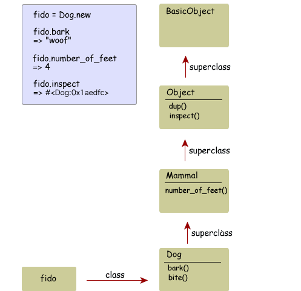

<!SLIDE subsection>
# Classes as objects (advanced)

<!SLIDE>

    @@@ ruby
    class Person

is syntactic sugar

same as

    @@@ ruby
    Person = Class.new

Note that `Person` is just a regular constant!

<!SLIDE>

    @@@ ruby
    class Person
      def name
        "Alice"
      end
    end

same as...

    @@@ ruby
    Person = Class.new
    Person.class_eval do
      def name
        "Alice"
      end
    end

# the singleton class

aka "eigenclass" (but "metaclass" is incorrect)

from
<http://blog.madebydna.com/all/code/2011/06/24/eigenclasses-demystified.html>

# method lookup goes through the eigenclass

from
<http://blog.madebydna.com/all/code/2011/06/24/eigenclasses-demystified.html>

