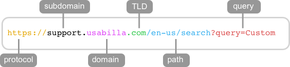

# URLs

* **U**niform
* **R**esource
* **L**ocator

# URL Diagram


(via [usabilla](https://support.usabilla.com/hc/en-us/articles/115000046145-Target-visitors-on-a-particular-page-URL-vs-Path))

Read https://doepud.co.uk/blog/anatomy-of-a-url

# Protocol

* `http` - the basics
* `https` - "S" means "Secure"
* `file` - local filesystem

many others...

# Host

`www.example.com`

# Path

`/en/search`

# Query Parameters

`?query=Heart`

### More complicated parameters

`?query=80s+Rock+Bands&page=2`

* the `+` means "space"

* see [Query String Escaping](https://en.wikipedia.org/wiki/Query_string) aka [URL encoding](https://en.wikipedia.org/wiki/Percent-encoding)

# Getting Query Parameters in JavaScript

`document.location.search` returns the URLs query string (everything after the `?`)

```
@@@js
let params = new URLSearchParams(document.location.search.slice(1));

for (let p of params) {
  console.log(p);
}

let name = params.get("name");
```

(`slice(1)` removes the `?` from the `search` field of the `document.location` URL.)

https://developer.mozilla.org/en-US/docs/Web/API/URLSearchParams

# anchor

`#profile` is a hint to the *browser*

to scroll to a location *inside* the document
