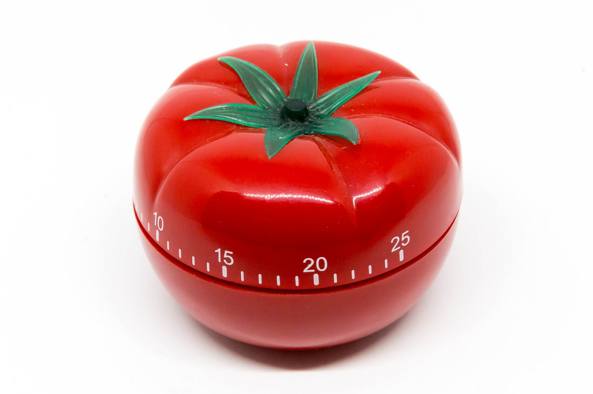

# Pomodoro

The [Pomodoro Technique](https://en.wikipedia.org/wiki/Pomodoro_Technique) is a [useful way](https://lifehacker.com/productivity-101-a-primer-to-the-pomodoro-technique-1598992730) to focus on a problem [for a little while... but not too long](https://en.wikipedia.org/wiki/Timeboxing) that encourages regular breaks and can [change your perception of time itself](https://hackernoon.com/change-how-you-perceive-time-618282a1a9ec). 



Build a single-page app that counts down from 25 minutes and makes an audible and/or visual alert when the time elapses.

## Wireframes

```
           🍅
         25:00   
[Start] [Pause] [Reset]
```

## Considerations

* the buttons should be *enabled* and *disabled* based on the system's state; e.g. if the timer is not running, the Pause button should be disabled
* JavaScript timing events are not guaranteed to be precise. That means that even if you ask for a callback once a second, you might actually get a callback every 1.1 seconds or every 0.8 seconds. That means that you cannot simply decrement a "seconds" variable once per callback if you want accurate wall-clock time synchronization.
* seconds should be 0-padded e.g. `1:03` not `1:3`

## Stories

<!--box-->

### Countdown

**Given** a set duration of 25 minutes

**When** the user clicks the Start button

**Then** the timer should begin counting down once per second, following the sequence: `24:59`, `24:58`, `24:57`, ... `24:00`, `23:59`, ... and so on

<!--/box-->
<!--box-->

### Ding!

**Given** that the timer is counting down 

**When** it reaches `0:00`

**Then** it should [play a sound](https://stackoverflow.com/a/18628124/190135)

**And** the timer should stop counting down

**And** the Start and Pause buttons should be disabled

<!--/box-->
<!--box-->

### Flash!

**Given** that the timer is counting down 

**When** it reaches `0:00`

**Then** it should visibly flash the screen (be creative)

**And** the timer should stop counting down

**And** the Start and Pause buttons should be disabled

**When** the user clicks Reset

**Then** the flashing should stop

<!--/box-->
<!--box-->

### Reset

**When** the user clicks Reset

**Then** the timer should become set to `25:00`

* What if the timer is already running? Should it continue to run, or pause at 25:00?

<!--/box-->

## Tech

* JavaScript [timing events](https://www.w3schools.com/js/js_timing.asp) like [setInterval](https://developer.mozilla.org/en-US/docs/Web/API/WindowOrWorkerGlobalScope/setInterval)
* HTML5 [Audio](https://developer.mozilla.org/en-US/docs/Web/API/HTMLAudioElement)
* [Date.now()](https://developer.mozilla.org/en-US/docs/Web/JavaScript/Reference/Global_Objects/Date/now) function

## v2

* use [Notifications](https://developer.mozilla.org/en-US/docs/Web/API/Notifications_API)
* keyboard shortcuts
* change duration to 2 different set values (10 min and 2 min)
* change duration to arbitrary value (user input)
* display the remaining time in the title of the tab (or browser window) so users can check it at a glance
* look at <https://tomato-timer.com/> for inspiration

