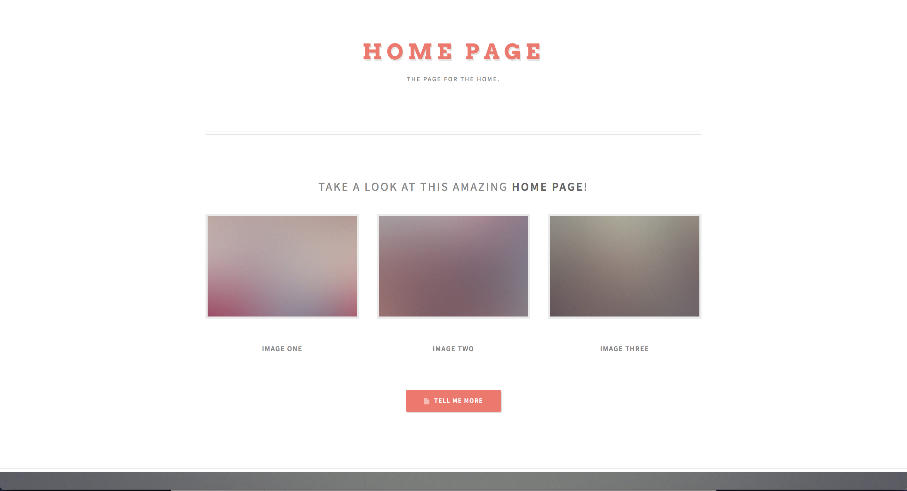
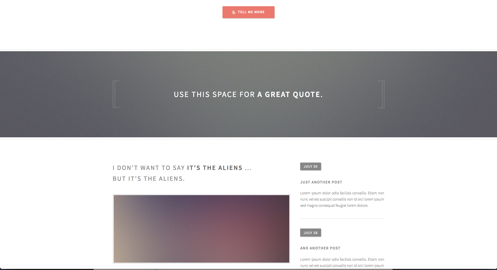
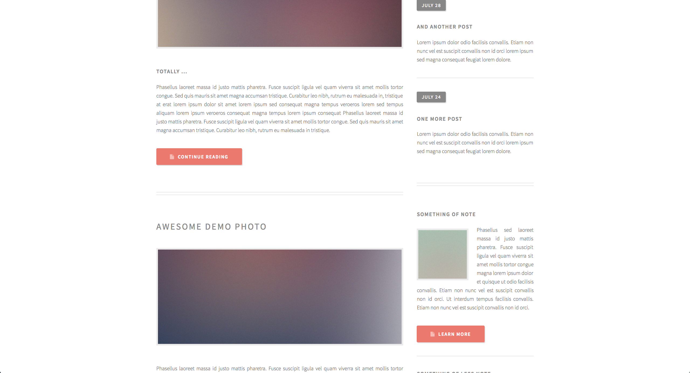
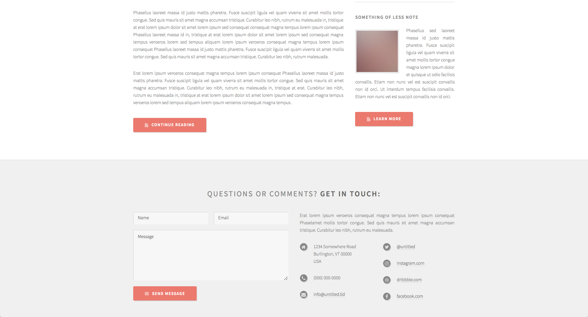
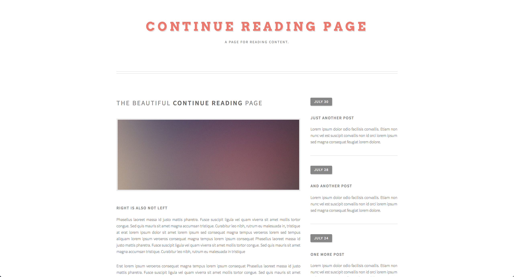
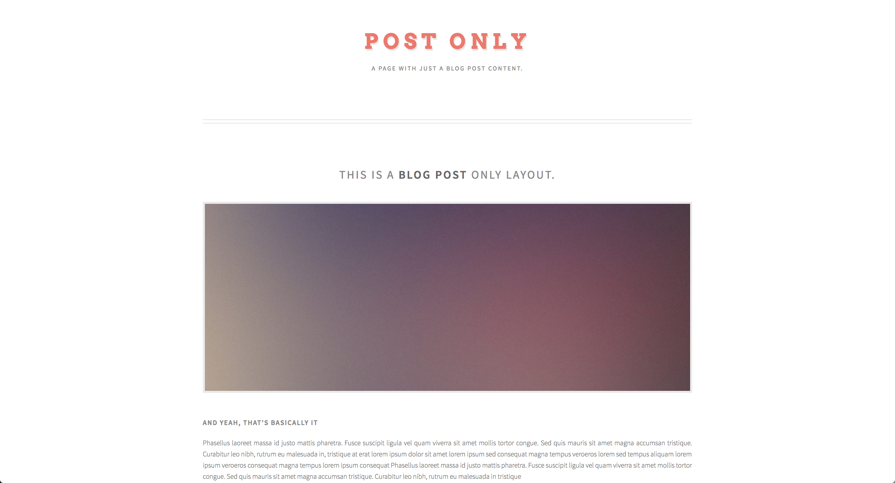

# Remock

In this project you will re-create a complicated blog style web page.

## Image Assets

[Use these HTML Mock Screen-shots for use in building the web-site.](https://drive.google.com/drive/folders/1Y5G571wVANV62R0D_6vPe8YFQe9gAD6O?usp=sharing)

[Video Walk-though of the web-site with interactions](https://drive.google.com/open?id=1XIVPNTcvcjIio1SaC2npyetsqlCvANN9)

## Goals

  * Using display, position, and float for layout
  * Spacing of elements
  * Color matching
  * Matching typography
  * Hover-ability highlighting

## Stories

<!--BOX-->
### Make it work

Create a page layout with empty `div`s and other page elements. Don't worry about making all the content correct; focus on the layout.

> After this phase, do a git commit and a demo.

<!--/BOX-->

<!--BOX-->
### Make it right

* Fill in the page content.
* Make interactive elements work correctly.

> After this phase, do a git commit and a demo.

<!--/BOX-->

<!--BOX-->
### Make it better

Experiment with design improvements. For example:

* fonts and typography
* whitespace adjustment
* navigation reorganization
* clearer separation between functional page elements

<!--/BOX-->

## Screen-shots

### Home Page

====================

### Continue Page

====================

### Blog Post Page

