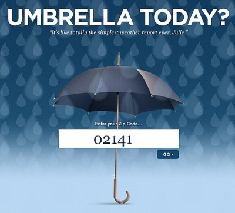

# Umbrella Today

Once upon a time, there was a real live app called [Umbrella Today](https://robots.thoughtbot.com/umbrella-today). It was the best weather forecasting app ever invented. It worked like this:

Every morning at 7:00 am, if it was going to rain that day, it sent you a text message saying "Umbrella today!"

Sadly, the app has now gone the way of all bits. But we can rebuild it!

## Discussion

We will build this app in several phases:

**Command-line only** The user enters their zip code; the app calls a weather forecast API and parses the result; the app then returns one of three answers:

1. _yes_ if there is rain in the forecast
2. _no_ if there isn't
3. _error_ if there was a problem connecting to the weather API (after a reasonable timeout) (and making sure to *print* a human-readable error message from the response if possible)

Once you figure out how to call the API from JavaScript, the most difficult part will likely be dealing with failure cases.

There are several weather forecasting services you could use. Research them and choose one.

* Dark Sky - https://darksky.net/dev
* OpenWeatherMap - http://openweathermap.org/api
* WUnderground - https://www.wunderground.com/weather/api/

**Web Server** Write a server-side web app that asks the user for their zip code, then responds with "Umbrella today!" or "All clear!" as appropriate. 

> Q: Why does this need to be a server-side web app? Couldn't we make the API call from inside the browser? 

> A: We could, but that would expose our confidential API key; it's safer if it's only stored on the server.

**Slack Bot** Using the [Slack Web API](https://api.Slack.com/web), write a [Slack App](https://api.slack.com/slack-apps)that wakes up every morning at 7:00 am, makes the call, and then, if appropriate, posts "`☔ Umbrella today!`" to a Slack channel.

This bot will need to live on a server (e.g. Heroku) and will need to be configured with parameters for location, Slack group and channel name, Slack and weather API credentials, time(s) to check...

To learn about Slack Apps you might want to walk through [this tutorial on slash commands and message buttons](https://api.slack.com/tutorials/intro-to-message-buttons).

**SMS Server** Write a server-side web app that stores a list of phone numbers (along with associated zip code and time info). Provide a web-based form to sign up (like the screenshot below), and an SMS-reply based way to delete your account.

